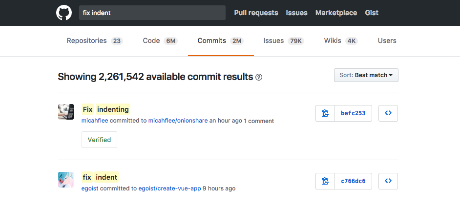
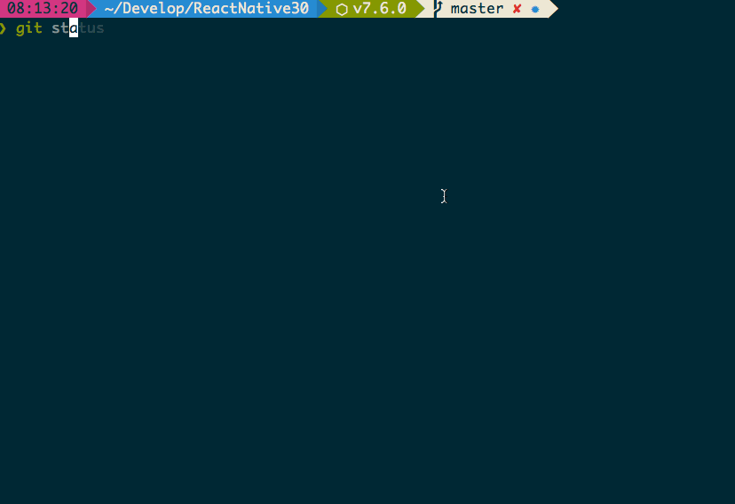

> 具备基本工程素养的同学都会注重编码规范，而代码风格检查（Code Linting，简称 Lint）是保障代码规范一致性的重要手段，你的工作流中有 Lint 环节么？有的话你用的爽么？你在团队中推广过 Lint，但是大家都不买账？究竟是为啥？

## Lint 是什么？

探讨怎么做之前，我们很有必要给 Lint 来个清晰、准确的定义，[wikipedia 的定义](https://en.wikipedia.org/wiki/Lint_%28software%29)如下：

> In computer programming, lint is a Unix utility that flags some suspicious and non-portable constructs (likely to be bugs) in C language source code; generically, lint or a linter is any tool that flags suspicious usage in software written in any computer language. The term lint-like behavior is sometimes applied to the process of flagging suspicious language usage. Lint-like tools generally perform static analysis of source code.

简单来说，Lint 就是对代码做静态分析，并试图找出潜在问题的工具，实战中我们也用 Lint 来指使用工具的过程。

## 为什么要 Lint？

使用 Lint 会有什么好处呢？在我看来至少具有如下 3 点：

* 更少的 Bug，剑桥大学的[研究](http://www.prweb.com/releases/2013/1/prweb10298185.htm)发现，全世界每年因为软 Bug 造成的经济损失约 3120 亿美金；
* 更高的开发效率，工程师平均会花掉 50% 的工作时间定位和解决各种 Bug，其中不乏那些显而易见的低级错误，而 Lint 很容易发现低级的、显而易见的错误；
* 更高的可读性，代码可读性的首要因子是“表面文章”，表面上看起来乱糟糟的代码通常更难读懂；

可以毫不客气的说，如果你不做 Lint，就是在浪费自己的时间，浪费公司的资源。既然做 Lint 的预期效果很好？该怎么做呢？

## 提交后 Lint：反馈链条太长？

说到怎么做，多数人会自然而然的想到各种 Lint 工具，目前社区中针对各种语言都开发了 Lint 工具，前端能用到的就有大把：[ESLint](http://eslint.org/)、[Standard](https://standardjs.com/index.html)、[SCSSLint](https://github.com/brigade/scss-lint)、[JSONLint](https://github.com/zaach/jsonlint)、[HTMLHint](https://github.com/yaniswang/HTMLHint) 等。GitHub 官方出品的 [Lint 工具列表](https://github.com/showcases/clean-code-linters) 也是个非常不错的参考。

很多同学选择在持续集成阶段（后文用 CI 代称）做 Lint，比如使用远程的 Git Hooks 来触发。但是从实际的经历来看，这种做法的反馈链条通常如下：

```
代码提交 --> 发现问题(远程) --> 修复问题 --> 重新提交 --> 通过检查(远程)
```

整个过程可能会浪费掉你不少时间，毕竟 CI 过程通常不仅是在做 Lint，如果你是那种不知道自己时间每天都去哪儿了的工程师，可以反思下自己或者团队的工作流是否是这样。并且，请相信我，你不是少数人。

你有没有这样的经历：吭哧吭哧写了几天代码，各种验收都通过了，最后被 CI 拒绝，竟是因为你的代码中少加了一个逗号，这时候心情简直崩溃到无法形容：


从 GitHub 上各种修复 Lint 的提交数量不难发现工程师在修复 Lint 问题上浪费的时间，比如搜索 "fix lint"，多达 45W 次提交：


再比如搜索 “fix indent”，多达 226W 次提交，是不是很触目惊心？



只在 CI 流程做 Lint 的缺点也是显而易见的：

* Lint 在整个开发工作流中的反馈链条太长，浪费时间、注意力和资源，最致命的；
* CI 流程搭建成本比较高，即使有各种 CI 服务，步骤也还是比较繁琐；

我们该怎么改进？

## 提交前 Lint：错误信息不相关？

为了缩短 Lint 的反馈链条，把 Lint 挪到本地是最有效的办法。常见做法是使用 [husky](https://github.com/typicode/husky) 或者 [pre-commit](https://github.com/observing/pre-commit) 在本地提交之前做 Lint。

使用 husky 的具体做法如下：

首先，安装依赖：

```bash
npm install -D husky
yarn add --dev husky
```

然后修改 package.json，增加配置：

```javascript
{
  "scripts": {
    "precommit": "eslint src/**/*.js"
  }
}
```

最后尝试 Git 提交，你就会很快收到反馈：

```
git commit -m "Keep calm and commit"
```

但是在遗留代码仓库上工作的同学很快会遇到新的问题，开启 Lint 初期，你可能会面临成千上万的 Lint Error 需要修复。部分同学对下面这个图可能并不陌生：只改了文件 A，但是文件 B、C、D 中也有大量错误。


把整个仓库都格式化不失为一种选择，但是实际上需要很大的勇气。多数人在项目中运用新工具都希望是渐进式的，而不是推到重来式的，因为相比而言，业务系统稳定是更重要的事情。简单的把 Lint 挪到本地，反馈链条是缩短了，但是面对每次改动，**工具还是给出了太多不相关的信息**，这无疑与小步快跑的互联网节奏是相违背的。

该怎么破？

## 只 Lint 改动的：66666

如果把 Lint 挪到本地，并且每次提交只检查本次提交所修改的文件，上面的痛点就都解决了。Feedly 的工程师 [Andrey Okonetchnikov](https://www.npmjs.com/~okonet) 开发的 [lint-staged](https://github.com/okonet/lint-staged) 就是基于这个想法，其中 staged 是 Git 里面的概念，指待提交区，使用 `git commit -a`，或者先 `git add` 然后 `git commit` 的时候，你的修改代码都会经过待提交区。

lint-staged 用法如下：

首先，安装依赖：

```bash
npm install -D lint-staged
yarn add --dev lint-staged
```

然后，修改 package.json 配置：

```javascript
{
  "scripts": {
    "precommit": "lint-staged"
  },
  "lint-staged": {
    "src/**/*.js": "eslint"
  }
}
```

最后，尝试提交的效果：



实际上，lint-staged 给了你提交前代码操作的更大自由度，比如使用下面的配置，自动修复错误：

```javascript
{
  "scripts": {
    "precommit": "lint-staged"
  },
  "lint-staged": {
    "src/**/*.js": ["eslint --fix", "git add"]
  }
}
```

或者使用下面的配置，自动格式化代码（谨慎使用）：

```javascript
{
  "scripts": {
    "precommit": "lint-staged"
  },
  "lint-staged": {
    "src/**/*.js": ["prettier --write", "git add"]
  }
}
```

此外，lint-staged 和 prettier [已经集成到 create-react-app 中了](https://github.com/facebookincubator/create-react-app/pull/1759)。你是不是也应该好好打磨下自己的 Lint 工作流了？

## 总结

有人说前端攻城狮是世界上最奇怪的动物，提交代码时用 prettier 把代码排版的很美观，但部署上线时又使用 uglify 把代码压缩的连亲妈都不认了，事实是，如果我们写出来的代码本来就很丑陋，就根本不需要用 uglify。希望读到这里的你能把 Lint 工作流打磨到极致，把更多时间专注在解决真正的问题上，成为真正高效的工程师。

## One More Thing

本文作者王仕军，商业转载请联系作者获得授权，非商业转载请注明出处。如果你觉得本文对你有帮助，请点赞！如果对文中的内容有任何疑问，欢迎留言讨论。想知道我接下来会写些什么？欢迎订阅我的[掘金专栏](https://juejin.im/user/57a7f634d342d300576b738d)或[知乎专栏](https://zhuanlan.zhihu.com/feweekly)：《前端周刊：让你在前端领域跟上时代的脚步》。
