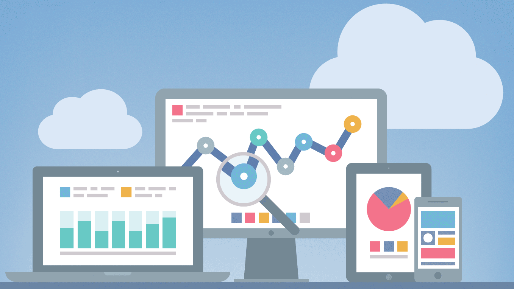

> 翻译自 Google 工程师 Philip Walton 的[文章][24]。共 3754 字，读完需 7 分钟。合格的工程师要能认识到数据和功能一样重要，因为准确的数据收集是产品迭代、市场营销的决策基础。本文会帮你剖析为什么你常用的统计方式是错的？然后给出可行的解决方案。

直言不讳的说，目前市面上的 Page View（常说的PV，即用户浏览页面的次数）统计工具无法准确统计越来越多的新站点，且已经和 WEB 技术的演进方向完全脱节。

因为在大多数情况下，这些工具假设每次页面浏览（Page View）对应一次页面加载（Page Load），且每次页面加载完成后都会运行一些统计代码，将 Page View 事件发送到后端服务器。任何不符合这种模式的网站都需要工程师做额外的工作才能统计到正确的结果，然而大多数前端工程师似乎不具备这方面的专业知识，或者干脆没有时间。

现实是，WEB 技术在过去 10 年间发生了巨大的变化，越来越多的网站已经不符合传统的网站模式，而我们的分析工具演化并没有跟上。

## 问题在哪儿？

举个具体的例子，考虑 [mail.google.com][0]（Gmail），使用 Gmail 的大多数人在首次打开后会保持它在后台运行，每隔一段时间去检查是否有新消息，如果有新消息，会直接打开阅读，整个过程无需刷新页面。

由于绝大多数 Gmail 用户几乎从来不刷新页面，从统计分析的角度就产生了一些非常有趣但重要的疑问：

* 如果用户打开 Gmail 一次，而在接下来的几天之内使用数百次，但是并没有刷新页面，这种情况应该只算一个 Page View 么？
* 如果用户点击 Gmail 左上角的 Logo 来刷新页面内容，或者移动端的下拉刷新，是否应该算一个新的 Page View？这种动作与完全刷新页面有何不同？
* 如果用户打开并阅读一封新邮件，实际上无需刷新页面，是否应该计算为一个新的 Page View？
* 如果两个用户每天访问 Gmail 的次数完全相同，但是其中一个每次刷新，而另一个保持页面在后台运行，这两种使用模式的 Page View 统计结果应该有很大的不同么？

列举这些疑问想说明的问题是，对于某些站点，继续使用传统的 Page View 统计方法会导致不准确的统计结果，而在 WEB 应用的技术实现方案随时间推移不断演进的情况下，这种不准确会变的非常离谱。

试想，你在传统的 WEB 网站中添加了统计代码，几个月后，你将该网站更新为[单页应用][1]（SPA，或 Single Page Application），而没有修改统计代码代码。再过几个月，你又将网站更新为[渐进式 WEB 应用][2]（PWA，或 Progressive Web Application），这种技术可以在后台重新加载内容并脱机工作），这时候你仍然没有更新统计代码。如果这段时间应用的访客数量及使用模式没有变化，你肯定会期望统计结果不出现大幅度波动。

不幸的是，在上述情况下，即使你改善了用户体验，但 Page View 的统计结果可以肯定是下降的。这是一个非常糟糕的情况：你希望改善网站的交互体验，但是无法用数据说服任何人这样做是值得的，因为统计数据给出的结果是完全相反的。

## 该怎么解决？

任何技术问题总会有解决办法，本文提出的解决方案则需要回归 Page View 这个指标的本原。我们需要追踪的不是页面**被加载（loaded）**的次数，而是**被浏览（viewed）**的次数。

我们可以利用 [Page Visibility API][3] 达成目的，实际上该 API 已经存在了很长时间，并且几乎所有的主流桌面和移动浏览器都[支持][23]。

事实证明，统计页面被浏览的次数而不是被加载的次数能优雅地解决掉传统统计方式不能处理的很多问题：

* 当用户打开的某个选项卡转入后台，然后在几小时或几天之后再切回来，但不重新加载页面；
* 当用户打开某个页面作为参考，并来回切换以快速浏览其中的内容，但不重新加载页面；
* 当用户在后台选项卡中打开页面，然后忘记了，从来没有实际浏览页面内容；

Page Visibility API 由 [document.visibilityState][5] 属性以及 [visibilitychange][6] 事件组成。基于这两个 API，你可以确保只会在页面的 visibilityState 可见时才发送 Page View 统计。此外，你还可以监听 visibilitychange 事件，在用户重新切回到在后台运行有段时间的应用时发送新的 Page View 统计。Page Visibility API 很好的解决了加载完成后几乎不需要刷新的 WEB 应用的 Page View 统计问题。

解决方案的第二部分是 [History API] [7]，这是 SPA 应用构建的基础技术，目前主流浏览器都支持（[详见][8]），因此统计工具可以通过监听 URL 变化来发送类似于传统网站的页面统计。

## 该怎么实现？

利用 Page Visibility 和 History API 来准确统计 Page View 的基本思路如下（这种思路适用于传统网站、SPA、PWA）：

1. 页面加载时，如果页面的 visibilityState 是可见的，发送 Page View 统计；
1. 如果页面的 visibilityState 是隐藏的，就监听 visibilitychange 事件，并在 visibilityState 变为可见时发送 Page View 统计；
1. 如果 visibilityState 由隐藏变为可见，并且自上次用户交互之后已经过了“足够长”的时间，就发送新的 Page View 统计；
1. 如果 URL 发生变化（仅限于 [pathname][10] 或 [search][11] 部分发送变化, [hash][12] 部分则应该忽略，因为它是用来标记页面内跳转的) 发送新的 Page View 统计；

上述步骤 3 是最重要的，但同时也是最模糊的和颇具争议的，关键的问题是：_究竟多长才算是“足够长”？_一方面，你可能并不想在每次 visibilityState 发生变化的时候都发送新的 Page View 统计，因为对于用户来说，在选项卡之间来回切换是非常常见的，而实际情况是，某些应用同时在多个选项卡中打开使用是最方便的，而这就伴随这大量的选项卡切换。另一方面，你又期望统计到在一段时间没有和应用交互之后用户的**回访（returning）**行为，也就是说需要统计到用户多次使用的行为。

幸运的是，所有的统计工具都定义了一种区分多次使用的方式，即会话，或者叫 [Session][13]。会话是在给定时间窗口中发生的用户交互的集合，当某个预设的时间段过去时会话就结束了。比如，默认情况下 Google Analytics 的会话在 30 分钟无交互的情况下结束。而大多数统计工具都提供了会话时长自定义的功能。

所以回到上面列表中的第三步，我的建议是，如果用户会话已结束，并且页面的 visibilityState 从隐藏变为可见，则应发送新的 Page View 统计。在会话内发生的 visibilityState 变更不应被视为不同的 Page View。

**注意：**如果你使用 [autotrack][14]（特别是 [pageVisibilityTracker][15] 和 [urlChangeTracker][16] 插件），你就无需自己实现上面的逻辑。这些插件可以自动处理所有这些情况，当然你可以使用配置项来自定义插件的行为）。

### 如何减少误报？

在为 [autotrack][14] 创建 [pageVisibilityTracker][15] 插件时，我对基于 Page Visibility API 的多种实现方案进行了大量彻底的测试，发现利用启发式信息在避免误报上是非常必要的。

例如，用户使用键盘快速在一堆打开的标签页中来回切换，结果是很多页面的 visibilityState 从隐藏变为可见，但是很快又恢复原状。在我的测试中，有相当比例的 Page View 是由于在会话超时后 visibilityState 变为可见导致，但是紧接着 visibilityState 又恢复为隐藏。而 99% 类似这种的页面从可见恢复为隐藏状态的间隔都在 5 秒以内。

当我分析自己的使用模式之后，这种现象的存在并不奇怪，很常见的操作有：意外的切换到一个选项卡，但是很快就离开了；切换到一个选项卡，只因为我要切换到其他的选项卡，而这个选项卡刚好在夹在中间（这里使用键盘切换）；切换到某个选项卡，只是为了关闭它。在所有这些情况下，发送新的 Page View 并没有任何意义，而在上报 Page View 统计之前设置 5 秒的超时可以防止 99％ 以上的误报。

### Page View 和 Page Load

有时候你可能想了解你的网站加载（Page Load）了但从未被浏览过的频率，你可能还想知道页面浏览是由初始页面加载触发还是由 visibilityState 或 URL 变化导致的。

显然你可以创建一个自定义维度来统计页面加载（实际上我通常会这样做），但是透过这个问题我们能清楚的认识到，我们真正需要的是两个独立的指标：**页面浏览（Page View）**和**页面加载（Page Load）**。幸运的是，如今的大多数统计工具允许用户[自定义指标][17]来统计他们想要的任何数据，而 [autotrack][14] 支持通过[配置项][18] 帮你把页面浏览与页面加载的统计分开。

通过将页面浏览与页面加载解耦，我们就能完全掌握 Page View 这个指标的真实含义：测量用户实际浏览页面的次数，而无论页面加载了多少次。

### Page View 和 Session

有些读者可能会嘀咕：只要你正确的统计到了初次页面加载后用户的所有交互，只统计首次页面加载又有什么关系呢？Page View 的正确统计为什么至关重要呢？

虽然看起来似乎是一个合理的问题，但如果你了解大多数统计工具使用的数据模型，你将很快意识到这些问题本身是站不住脚的。

大多数分析工具假定每个会话都至少包含一个 Page View，该 Page View 用于确定诸如 [_Landing Page_][19]（落地页）和 [_Exits_][20]（跳出页）等指标。如果你仅仅统计了初次页面加载，然后后续所有会话只包含事件统计，则大多数会话报告变得一团糟。而几乎所有的传统 WEB 统计工具都使用这种模型来计算，这也从侧面印证了传统模型的局限性。

暂且把工具限制放在一边，另外一个让你信服的论据是：所有包含了用户交互事件的会话都应该至少包含一次 Page View，毕竟，如果没有打开页面，你怎么跟它交互呢？在会话超时、visibilityState 变为可见时发送新的 Page View 能好好的解决这个问题。

## 总结和 TIPS

希望你读完这篇文章，能重新思考 Page View 的正确姿势，如果你在自己项目中使用了统计工具，可以结合本文的建议把统计做到准确。

统计工具应该衡量的是用户参与度，而不应该与网站的技术实现相耦合。当用户体验改善时，我们应该可以通过统计工具的分析报告来证明。这是利用技术推动业务发展最直接的方法。

如果你使用的是 Google Analytics，则可以通过使用 [autotrack] [14]（强烈建议 SPA 或 PWA 项目使用）来将本文的解决方案运用到项目中，要查看如何配置 autotrack 的示例？请移步 [analyticsjs-boilerplate][21] 仓库。

[0]: https://mail.google.com
[1]: https://en.wikipedia.org/wiki/Single-page_application
[2]: https://developers.google.com/web/progressive-web-apps/
[3]: https://developer.mozilla.org/en-US/docs/Web/API/Page_Visibility_API
[4]: http://caniuse.com/#feat=pagevisibility
[5]: https://developer.mozilla.org/en-US/docs/Web/API/Document/visibilityState
[6]: https://developer.mozilla.org/en-US/docs/Web/Events/visibilitychange
[7]: https://developer.mozilla.org/en-US/docs/Web/API/History
[8]: http://caniuse.com/#feat=history
[9]: https://philipwalton.com/articles/how-we-track-pageviews-is-all-wrong/#footnote-1
[10]: https://developer.mozilla.org/en-US/docs/Web/API/HTMLHyperlinkElementUtils/pathname
[11]: https://developer.mozilla.org/en-US/docs/Web/API/HTMLHyperlinkElementUtils/search
[12]: https://developer.mozilla.org/en-US/docs/Web/API/HTMLHyperlinkElementUtils/hash
[13]: https://support.google.com/analytics/answer/2731565
[14]: https://github.com/googleanalytics/autotrack
[15]: https://github.com/googleanalytics/autotrack/blob/master/docs/plugins/page-visibility-tracker.md
[16]: https://github.com/googleanalytics/autotrack/blob/master/docs/plugins/url-change-tracker.md
[17]: https://support.google.com/analytics/answer/2709828
[18]: https://github.com/googleanalytics/autotrack/blob/master/docs/plugins/page-visibility-tracker.md#options
[19]: https://developers.google.com/analytics/devguides/reporting/core/dimsmets#view=detail&group=page_tracking&jump=ga_landingpagepath
[20]: https://developers.google.com/analytics/devguides/reporting/core/dimsmets#view=detail&group=page_tracking&jump=ga_exits
[21]: https://github.com/philipwalton/analyticsjs-boilerplate
[22]: https://support.google.com/analytics/answer/1033068#NonInteractionEvents
[23]: http://caniuse.com/#feat=pagevisibility
[24]: https://philipwalton.com/articles/how-we-track-pageviews-is-all-wrong/
