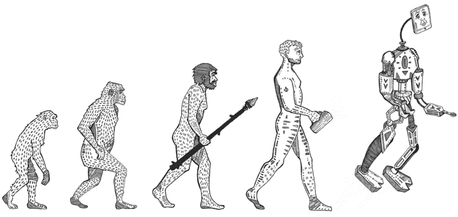

> 共 2835 字，读完需 5 分钟。写作本文的目的：构建自己关于前端工程师成长过程的认知模型，从自己的视角来分析 Programmer、Developer、Enginner 的能力结构与工程师成长过程的关联，并分享出来给大家，期望能对入门的前端同学有所借鉴和启发。需要提前说明的是，文中用到的工程师的不同叫法并不是要给工程师分类或者贴标签，因为工程师的成长过程是连续的，喜欢钻牛角尖的同学请自行绕路。

## 程序员 or 工程师

圈内对从事软件开发的同学有很多叫法，如程序员（Programmer）、开发者（Developer）、工程师（Engineer），甚至是码农，“码农”是圈内人用来自嘲的，那其他几个名词呢？表面上看起来都是做软件开发，叫什么真的重要么？

不得不说，叫什么并不重要，不论是自称还是他称，什么学历、几年工作经验也不重要，真正重要的是人所具备的能力。那么既然名称不重要？为什么还要谈论它？名称的真正意义在于能让我积极拓宽自己的视野，不断点亮自己的技能树，在职业发展的道路上不断积累、不断提升。

工程师做事的三重境界是什么？程序员、开发者、工程师这些叫法跟这三重境界又有啥关系？

## 第 1 重境界：把事情做成

把事情做成是公司对员工的基本要求，绝大多数入门同学就处在这个境界，这个境界的人可称为程序员（Programmer），对于 Programmer 通常需要告诉他做什么、怎么做，他所需要的是执行力和基础技能，这里的技能包括：基本的编程技能，至少会一门编程语言，对这门语言的熟悉程度至少能够让他把基本需求解决。具体到前端领域，对 Programmer 的要求就是需要能够使用 JS、CSS、HTML，并且熟悉编辑器、浏览器来完成基本需求。

以常见的 WEB 端统计为例，为了研究页面关键元素的用户行为，需要对用户的部分交互添加事件统计（更常见的叫法是“埋点”），比如单击事件，表单提交事件，如果使用百度统计，在页面中埋点的方法大概如下：

```html
<a onclick="_hmt.push(['_trackEvent', 'checkout', 'click']);">购买</a>
```

或者在 JS 中埋点：

```javascript
// 需要发送统计的时候
_hmt.push(['_trackEvent', 'checkout', 'click']);
```

接下来由于业务需要，相同的统计，需要往 Google Analytics 发一份，最简单粗暴的解决方案如下：

```html
<a onclick="_hmt.push(['_trackEvent', 'checkout', 'click']);
            _gaq.push(['_trackEvent', 'checkout', 'click']);">购买</a>
```

JS 中也需要做同样的修改：

```javascript
// 需要发送统计的时候
_hmt.push(['_trackEvent', 'checkout', 'click']);
_gaq.push(['_trackEvent', 'checkout', 'click']);
```

如果网站的页面规模、统计事件量小，变更埋点可能会比较轻松，但当页面和事件数量随着业务发展激增，估计程序员会埋点埋到手抽筋了。这个时候 Programmer 会不高兴，很可能 Boss 也会不高兴，因为埋点效率提不上来，并且容易出错。聪明的 Programmer 会发现，仅仅从表面上把问题解决貌似还不够。该如何破局？

## 第 2 重境界：把事情做好

具备什么样的能力才能把事情做好？对基本技术的熟悉程度超过（需要超过一大截）把事情做成的需要；对于业务需求有一定的前瞻性；能给出比较健壮的技术方案，能一次解决一类问题而不是一个问题，知道什么样的方案是不靠谱的，具备这些能力的人可称为开发者（Developer）。

不可否认，Developer 是升级版的 Programmer，相比而言，Developer 大多数时候需要自行找到问题的解决方案并落地实施。通俗的说，面对具体的技术、业务问题，Developer 能比 Programmer 顾及到更多的点，想到更多的方案。但是要实现这两个“更多”，需要的是努力、时间和经验的积累。

当然，从 Programmer 到 Developer 的进阶是可以加速的，需要压缩自己的时间在更短的时间内做更多的事情，注意这里不是把相同的事情重复 N 遍，如果是那样就很容易出现 3 年工作时间半年工作经验的尴尬。

回到上面提到的埋点方案，简单粗暴的解决方式存在什么问题？

* 首先，代码扩展性太差，后续如果需求方需要接入自建的统计，前端的工作量并没有减少，反而改起来会需要更加的小心翼翼；
* 其次，直接发送统计是否能保障精确送达，有没有可能存在漏报的情况，细心的同学肯定能想到这种风险；
* 最后，前端代码风格，其实不太推荐在 HTML 中内联书写 JS 事件，这就是脏代码的典型例子；

Developer 会如何解决这个问题呢？先理清楚埋点代码的本质：发送统计的动作、指定统计参数，其中发送统计的动作跟需要接入的统计平台有关，确保统计到达也跟这个动作有关，这个动作跟统计参数无关，而统计参数本身跟节点的关系比较紧密，动作和参数可以解耦开。

基于这样的认知，不难设计出下面的方案，在所有需要埋点的地方约定参数的标记方式，使用 `data-event-*` 参数标记事件名称、事件类型以及额外的参数：

```html
<a data-event-name='checkout' data-event-type='click'>购买</a>
```

然后，在页面级别监听那些埋点的节点，并且恰当的时机发送统计代码，简化版如下：

```javascript
// 相同的参数发送给所有已接入的统计平台，如果平台不同，适配工作也在这里做
const sendEventLog = (name, type, param) => {
    _hmt.push(['_trackEvent', name, 'click', param]);
    _gaq.push(['_trackEvent', name, 'click', param]);
};

// 针对单击事件的处理，其他事件可以类似处理
$(body).on('click', '[data-event-name][data-event-type="click"]', function (e) {
    // 拿到事件发生的节点
    const target = $(e.target);

    // 获取事件属性
    const name = target.attr('data-event-name');
    const param = target.attr('data-event-param') || '';

    if (!name) {
        return;
    }

    // 这里如果是链接跳转，需要走单独的逻辑
    sendEventLog(name, 'click', param);
});
```

上面探讨了从 Programmer 进阶到 Developer 的方法就是积累，那么怎么积累？基本法则是：做出好的东西先要知道好的东西长啥样。一方面，多读经典的书，仔细读高质量的文章，注意这里面**读远比收藏重要**，上哪里去找经典的书和高质量的文章？这需要建立自己的信息筛选机制；另外一方面，遇到问题要学会去搜索，找更多的解决方案，然后比较，融会贯通。

不得不承认，从 Programmer 进阶到 Developer 需要非常多的努力和积累才行，但是精进之路永无止境，下面说说第三重境界。

## 第 3 重境界：把事情做绝

能够把事情做绝的人，可以称得上是工程师（Engineer），那么到底怎么才算是把事情做绝？以统计埋点为例，能够洞悉埋点需求的本质，把日志发送和埋点标记解耦之后，将两者都做到极致。现实中埋点需求的来源通常是运营和产品经理，所有的变更基本都是由他们驱动，如果能够给他们提供工具管理页面中的埋点标记（思路关键词：XPath、微服务、浏览器插件，细节不在本文描述），就能把工程师从这种琐碎需求中解放出来去做更有意义的事情，这样也就改变了组织中不同员工间的协作方式，提高组织的效率。

想成为前端工程师，要先成为工程师。工程师应该具备怎样的能力？要回答这个问题，我们不妨仔细思考下什么是工程，[WIKIPEDIA](https://en.wikipedia.org/wiki/Engineering)的原文如下：

> Engineering is the application of mathematics and scientific, economic, social, and practical knowledge in order to invent, innovate, design, build, maintain, research, and improve structures, machines, tools, systems, components, materials, processes, solutions, and organizations.

简单说，工程就是运用知识去设计、创建、维护、改进工具、系统、流程和组织的过程，而工程师是推动这个过程的最主要角色。

工程师，首先要具备很强的学习能力，能**掌握完整的知识体系**，知识的来源并不重要，可以来自于自学，也可以来自于学校，以及生产实践的总结，只局限于一门编程语言或特定的几个工具是远远不够的，扎实的计算机科学基础是基石。具体到前端领域，基本的数据结构和算法、设计模式和变成范式、网络、JS、CSS、浏览器、性能、设计，软件质量、可维护性、可扩展性，软件工程化（构建、部署、运维、监控）。

工程师，还要具备良好的抽象思维能力，有了抽象思维能力就能够快速建立起系统运行机制的思维模型，也能把现实世界的业务问题转化为了恰当的模型，然后用技术去解决。具体到前端领域，比如前端应用的典型信息架构，状态机、栈、队列这些数据结构在前端的应用。

工程师，还要具备良好的沟通能力，沟通能力的好坏决定了你是否能准确理解需求的本质，是否能把自己的的设计方案清晰的展示给同事，而沟通的形式就不那么重要了，可以是书面文字，可以是白板、思维导图，甚至是动画演示。

工程师，还要具备平衡取舍能力，知道在哪些地方只需要做成，哪些地方需要做好，哪些地方要做绝，因为工程的要义就是取舍，在商业和技术之间寻求平衡点，这往往是很多人所忽视的能力。

冰冻三尺非一日之寒，成长为靠谱的前端工程师也不能一蹴而就，需要长时间的积累和沉淀，而到达这个境界之后就结束了么？绝对不是，阻碍人前进的最大障碍就是他的心智，还是那句话，精进永无止境。
