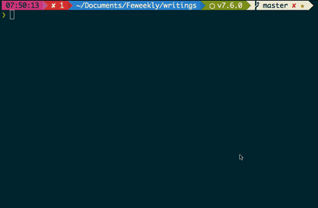

---

title: "使用 \"5W1H\" 写出高可读的 Git Commit Message"
date: "2017-04-28T22:12:03.284Z"
layout: post
path: "/posts/what-makes-a-good-commit-message/"
cover: "/posts/what-makes-a-good-commit-message/cover.png"
category: "tooling"
description: "所有工程师都知道，代码是编写一次，修改很多次，然后阅读更多次，代码可读性的重要程度不言而喻，但是在项目演进过程中有个很重要的记录也是会读很多次的，那就是 Git 的提交日志，而提交日志里面信息量最大的应该是 commit message，如何写出高可读的 commit message？"
---


> 所有工程师都知道，代码是编写一次，修改很多次，然后阅读更多次，代码可读性的重要程度不言而喻，但是在项目演进过程中有个很重要的记录也是会读很多次的，那就是 Git 的提交日志，而提交日志里面信息量最大的应该是 commit message，本文灵感来自 Linux 作者 [Linus Torvalds](https://github.com/torvalds) 在 GitHub 上对 commit mesage 的[吐槽](https://github.com/torvalds/linux/pull/17#issuecomment-5659933)。

## Git Log 之痛

在《The Art of Readable Code》这本经典书中，有个形象的比喻，衡量代码可读性的指标是阅读代码时每分钟的 WTF 次数，而在读 Git 提交历史的时候，不知道你有多少次爆粗口？不相信？你现在打开公司演进最快的项目，执行 `git log`，信息量过少甚至是误导的 `commit message` 非常常见，比如：

```
fix     => 这到底是 fix 什么？为什么 fix？怎么 fix 的？
update  => 更新了什么？是为了解决什么问题？
test    => 这个最让人崩溃，难道是为了测试？至于为了测试而去提交一次代码么？
```

说不定，你在这种 commit message 中也贡献了一份力量呢。

## 正视问题

我们先放下 Git 提交日志来看看典型的后端日志记录，如下面这则 `access log`：

```
remote_addr=[127.0.0.1] http_x_forward=[-] time=[19/Apr/2017:07:28:13 +0800] request=[GET /admin/edu/exam_scores/index/225 HTTP/1.1] status=[200] byte=[15745] elapsed=[0.309] refer=[http://stu.youcaiedu.com/admin/edu/contests] body=[-] ua=[Mozilla/5.0 （Macintosh; Intel Mac OS X 10_12_4） AppleWebKit/537.36 （KHTML, like Gecko） Chrome/57.0.2987.133 Safari/537.36] cookie=[JSESSIONID=aaaXlJyT6Ju-K-FbLuWPv; pgv_pvi=7986424832; pgv_si=s905561088; easycms=a16pbumhusksq3vpcogcv2n715; toolbarDisplay=hide; _ga=GA1.2.1604145244.1486802034] gzip=[7.71]
```

好的 `access log` 包含了哪些要素呢？

* 用户请求的时间（time）；
* 用户请求的地址（request）、从何而来（refer）；
* 用户来源（remote_addr）；
* 服务端响应（status, byte, elapsed）；
* ...

回忆下小学的知识，如何准确的描述一次事件？对，就是 `5W1H` 法则，具体说就是谁（who）在什么时候（when）、什么地点（where）因为什么（why）而做了什么事情（what），他是怎么做的（how），`access log` 是典型的事件日志，所以 `access log` 的记录完全可以参照 `5W1H` 方法去记录，你后来翻看的时候也不会错过细节。

回到正题，Git Log 本质上不也是事件日志么？必然是线上出了问题、产品提出了需求、工程师自己做了重构或技术改进才会导致它的变迁。如果没有详尽记录每次变迁的细节，代码 Review 的人怎么知道你做了什么？上线后遇到问题怎么去追溯？新人接手代码怎么去理解？

## 解决问题

因为 Git 的特殊性，Git 内核已经能把 `5W1H` 里面的 who、when 作为 commit 元信息记录下来，而研发活动的 where 明显是不需要记录的，真正需要工程师关注的是 what、why、how，这 3 项重要信息的载体就是 `commit message`。相信读到这里，你已经明白我想说什么了。

下面提出一种可以帮你写出高可读 commit message 的实践方法，这个方法并非原创，最早的实践来自于[这篇文章](https://robots.thoughtbot.com/better-commit-messages-with-a-gitmessage-template)。简单来说就是要在 commit message 中记录本次提交的 what、why、how，那么怎么把这个想法集成到你的开发工作流里面呢？可以参考下面的步骤来完成：

### 1. 设置 .gitmessage 模板

这是 Git 内置就支持的，你可以为每次提交的 commit message 设置一个模板，每次提交的时候都能促使你遵循这个思考的模式去编写 commit message，比如下面是我的模板，存放在 `~/.gitmessage`：

```
What: 简短的描述干了什么

Why:

* 我为什么要这么做？

How:

* 我是怎么做的？这么做会有什么副作用？
```

### 2. 让模板生效

在全局 Git 配置 `~/.gitconfig` 中添加如下配置：

```
[commit]
  template = ~/.gitmessage
```

### 3. 拥抱新模板

配置好模板之后，你要放弃在提交时直接指定 `commit message` 的习惯做法，即下面这种提交方式：

```
git commit -m "<commit message here>"
```

因为这种提交方式是不会弹出模板来让你填写的，你提交的命令应该改成：

```
git commit
```

具体的操作过程见下面的动图：



如同阿米尔汗在给他女儿做战术指导时说的话：拿五分很难，但不是没有可能。习惯的养成定不容易，但是是可行的，如果你认识到这点，离习惯养成已经很近了。

### 4. 给用 Vim 的同学

为了更好的 commit message 阅读者体验，可能你需要考虑给 `commit message` 里面的内容自动换行，让内容控制在轻松能看到的宽度之内，使用 Vim 的同学可以在你的 `~/.vimrc` 里面增加下面的配置：

```
autocmd Filetype gitcommit setlocal spell textwidth=80
```

### 5. 最重要的是内容

写出高可读的 `commit message` 需要你对每次提交的改动做认真深入的思考，认真回答上面提到的几个问题：

* What: 简短的描述这次的改动
* Why：为什么修改？就是要说明这次改动的必要性，可以是需求来源，任务卡的链接，或者其他相关的资料；
* How: 做了什么修改？需要说明的是使用了什么方法（比如数据结构、算法）来解决了哪个问题；

此外，还有个非常重要的点就是本次修改的副作用可能有什么，因为工程就是不断在做权衡，本次修改为以后留下了什么坑？还需要什么工作？都可以记录在 `commit message` 中。

从本质上来说，上面只是你思考问题的框架和记录内容的形式，真正重要的是你要仔细思考的那几个问题，因为一定程度上，`commit message` 就是文档，活的文档，记录了仓库的所有变迁。

## 总结

怎么让你的代码可以追溯也是优秀工程师必备的素质，相信读到这里，你对如何写出高可读的 `commit message` 的原因、好处、方法有了清晰的认识，纸上得来终觉浅，绝知此事要躬行，接下来你就需要把这种方法运用到实际工作中，相信我，你的同事发现之后会开始感激你、效仿你。
